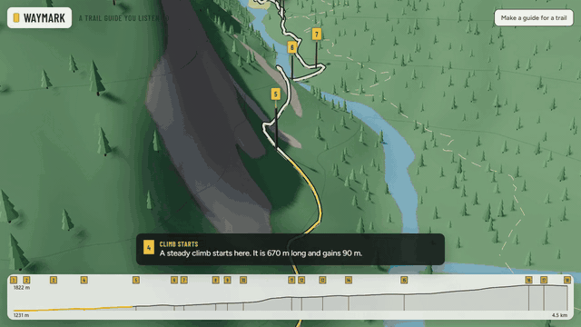
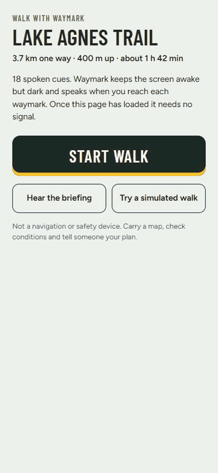
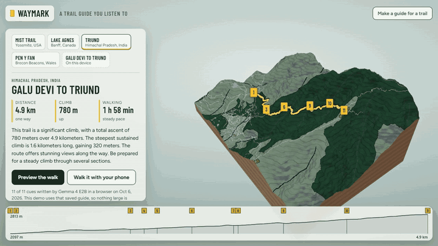

# Waymark

**A trail guide you listen to.** Pick a real trail. Waymark builds the facts from OpenStreetMap and open elevation data, and Gemma 4 E2B, running in your browser on WebGPU, writes a short spoken cue for every junction, climb and landmark. A 3D model of the real terrain previews the walk in about a minute. Then the phone goes in your pocket: it keeps the screen dark and speaks each cue when you reach that waymark.

**Live:** https://starknightt.github.io/waymark/



Built for the DEV Hacktoberfest Open-Source AI Challenge, Week 1 (Touch Grass). The repository was started on October 5, 2026, inside the challenge window.

## What it does

- **Four demo trails** that open instantly: Mist Trail (Yosemite, USA), Lake Agnes Trail (Banff, Canada), Galu Devi to Triund (Himachal Pradesh, India) and the Pen y Fan and Corn Du circular walk (Wales, UK). Their guides were written by Gemma 4 E2B in Chrome and are saved with the site, so trying them downloads nothing large. "Write it again on this device" regenerates a guide live.
- **Your own trail:** search a place and pick a mapped walking route, paste an OpenStreetMap route link, or open a GPX file. With WebGPU, Gemma writes the guide on your computer. Without WebGPU, Waymark builds a plain guide from the facts.
- **Preview the walk:** a flyover along the route over the real terrain, slowing at each waymark. Tick "Read the cues aloud" to hear the guide.
- **Walk it with your phone:** a QR code or link carries the route and the cues (about 1.5 KB, after the `#`, which browsers do not send to any server). On the phone, pocket mode keeps the screen awake but dark, follows GPS, speaks each cue at its waymark, and tells you if you stay more than 60 m from the route. "Try a simulated walk" replays the route at eight times walking speed for testing.

| Pocket mode during a simulated walk | Gemma 4 E2B writing a guide in the browser (2x speed) |
|---|---|
|  |  |

## How it works

```
OpenStreetMap route or GPX ──► stitched track (or footpath routing between points)
OpenStreetMap paths, water, woods, landmarks ──┐
open elevation tiles (Terrarium) ──────────────┼─► facts (code): junction turns from path geometry,
                                                │   climbs and descents, steps, bridges, water,
                                                │   viewpoints, high point, walking time
                                                ▼
                        up to 22 numbered waymarks, each with its facts
                                                ▼
          Gemma 4 E2B in the browser (LiteRT-LM, WebGPU) ── one constrained tool call:
          write_guide({ cues: [{ waymark: enum of real ids, text }], briefing })
                                                ▼
          fact checker (code): every number, with its meaning; every name; every turn
          direction and side; repairs or removes what the facts do not support
                                                ▼
             3D preview (Three.js)      ·      phone pocket mode (GPS + speech)
```

The model never does geometry. Code decides where the junctions are and which way the route goes, how long and steep each climb is, and what is near the path. Gemma turns those facts into short sentences a walker can follow without looking at a screen.

## Results

Twelve trails in seven countries (`tools/trails.json`), Chrome 154 on an RTX 4060 desktop GPU, greedy decoding. Every number below comes from `eval/results-tools-final.json` and `eval/results-free-final.json`.

| | One constrained tool call (shipped) | JSON in plain text |
|---|---|---|
| Cues written by Gemma | 180 | 180 |
| Passed every check unchanged | 171 | 170 |
| Changed by the checker | 9 (8 of them on Mount Takao) | 10 |
| Required waymarks covered | 120 of 120 | 120 of 120 |
| Invalid or unparseable output | 0 | 0 |
| Time per guide | 18.2 s | 11.4 s |
| Decoding speed | 44 tokens/s | 80 tokens/s |

- Model: `gemma-4-E2B-it-web.litertlm`, 2.0 GB, downloaded once and kept in the browser's private storage (OPFS). Loading it from there takes a few seconds (2.3 s on the test machine).
- A guide prompt is about 1,400 tokens; Gemma reads it at about 2,400 tokens per second.
- On the live site, in a fresh browser, the first guide took about 10 minutes, nearly all of it the 2.0 GB download; writing the guide took about 20 seconds.
- 35 unit cases for the fact checker run in Chrome (`npm run test:check`), most of them taken from real mistakes.

## Run it locally

```
npm install
npm run dev
```

Open http://localhost:5173. Writing a guide needs a browser with WebGPU and 16-bit float support (recent Chrome or Edge on a desktop GPU).

Developer pages (served by the dev server): `build.html` builds trail bundles, `eval.html` runs the model evaluation, `check-test.html` runs the checker cases.

```
npm run trails                 # rebuild public/trails from tools/trails.json
npm run eval -- tools          # write guides for every trail with Gemma (needs WebGPU)
npm run eval -- free
node eval/recheck.mjs eval/results-tools-final.json   # re-score saved model output with the current checker
npm run test:check
```

## What leaves your device

Requests for the trail's area go to OpenStreetMap (Overpass) and to the elevation tile service, place searches go to OpenStreetMap's Nominatim, and the model is downloaded once from Hugging Face. The guides, your position on the trail and the cues stay on your device.

## Limits

- Waymark is not a navigation or safety device. Carry a map and check conditions.
- Writing a guide needs WebGPU and about 2 GB of storage. Phones can play guides but are not expected to run the model.
- Cues are only as good as the map. Unmapped junctions are missed, and names in local scripts (for example 高尾山線) are spoken poorly by English voices.
- Elevation comes from roughly 10 to 30 m data, so sharp summits read lower than their true height.
- Walking times use Tobler's hiking function on a steady pace and do not include stops.
- On a phone, the page must stay open with the screen awake (dark) for GPS and speech to keep working.
- The 3D view exaggerates heights by 1.25 times.

## Credits and licenses

- Map data © OpenStreetMap contributors, available under the Open Database License (ODbL).
- Elevation: Terrarium tiles from AWS Open Data (Mapzen), derived from SRTM, NED, ETOPO1 and other sources.
- Model: Gemma 4 E2B by Google (Apache-2.0), web build from `litert-community/gemma-4-E2B-it-litert-lm`.
- Runtime: LiteRT-LM (`@litert-lm/core`, Apache-2.0). 3D: Three.js (MIT). Sun position: suncalc (BSD-2-Clause). QR codes: uqr (MIT). Offline support: vite-plugin-pwa (MIT). Fonts: Figtree and Barlow Condensed (SIL Open Font License).

Waymark's own code is MIT licensed (see `LICENSE`).
